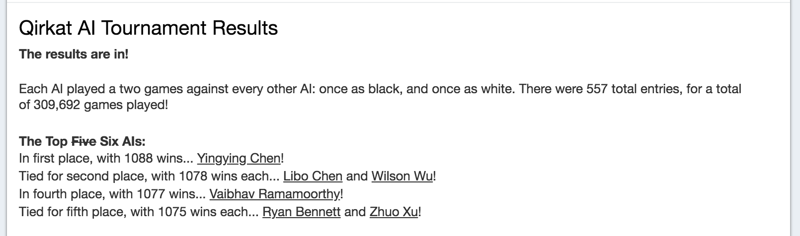

# Qirkat
In this project, a program was implemented to play the strategy board game Qirkat, also known as Alquerque. The ancient game of Qirkat is a forebear of checkers (draughts) and numerous other games throughout the world. The program also incorporated an AI so that a single human player can play. Besides, it also provides options for completely manual play and for completely automated play.  

Main files to refer to: [**AI.java**](https://github.com/ychen1030/qirkat/blob/master/qirkat/AI.java), [**Board.java**](https://github.com/ychen1030/qirkat/blob/master/qirkat/Board.java), [**Move.java**](https://github.com/ychen1030/qirkat/blob/master/qirkat/Move.java).  


## The Game
Qirkat is played by two players (whom we'll call black and white) on a 5x5 grid in which the 25 cells are connected to each other according to the pattern shown in the figure below.  


The white player moves first, after which play alternates. There are two types of move: non-capturing moves (which we'll simply call moves) and capturing moves (which we'll call jumps). Pieces may move one space along any of the 1 to 5 lines that radiate from its position and do not go backwards towards the base row (which is the bottom of the board for white, or the top of the board for black), except that pieces on the opponent's base row may not move (only jump).  

If a piece is adjacent to an enemy piece along a line, and the position immediately on the other side of the enemy piece along the same line is empty, it must capture that enemy piece by jumping over it to the empty position, removing the enemy piece from the board. Jumps may happen in any direction. If after jumping, another jump is possible, it must also be taken, with the process continuing as long as there is an available jump. At any point, when several different jumps are possible, the player may pick any one. Pieces are removed as soon as they are jumped, so no sequence of jumps can jump over the same position twice.

For example, on the board below, the transparent pieces show the five possible moves available to the black piece and the three possible moves available to the white piece.  


The three boards below show three possible capturing sequences (of 4, 1, and 3 white pieces, respectively) for the central black piece. The captured white pieces are numbered with the sequence in which they are captured.  


Each player must move or jump on every turn. In order to prevent ties, one additional rule was added: a piece may not move back to a position it has previously occupied unless it has jumped since occupying that position. Since pieces can only move forward or horizontally, this is equivalent to saying that when a piece moves horizontally, it must not make a horizontal move in the opposite direction when it is next played (it may still jump in that direction, however).  


## Textual Input Language
The players can each be either a manual player, entering moves as input, or an automated player (we'll call it an AI for short). Manual players can talk to the program using a textual interface, described in this section.  

At any given time, the program can be in one of two states:

- **set-up state**, meaning that no game is in progress. Pieces can still be moved according to the usual rules (in order to set up a position, for example). This is the initial state.  
- **playing state**, where players are entering moves and the game is not yet over.  

This program responds to the following textual commands. There is one command per line, but otherwise, whitespace may precede and follow command names and operands freely. Empty lines have no effect, and everything from a # character to the end of a line is ignored as a comment.

### Commands to begin and end a game
- **clear** Abandons the current game (if one is in progress), clears the board to its initial configuration, and places the program in the set-up state. Abandoning a game implies that you resign. This command is valid in any state.
- **start** Enters playing state (has no effect if already in playing state). White and Black alternate moves. If there have been moves made during the set-up state, then play picks up at the point where these moves leave off (so, for example, if there was one set-up move made before start, then Black will move first). In the (unusual) case where the set-up moves have already won the game, start causes the program to report the winner and go into set-up state.
- **quit** Abandons any current game (as for clear) and exits the program. The end of input has the same effect.

### Parameter-setting commands
- **auto C** Puts the game in set-up state and sets up the program so that player C (White or Black) is an AI. Initially, and after a clear command, White is a manual player and Black is an AI. Thus, the command auto White causes both White and Black to be AIs, so that the start command causes the machine to play a game against itself.
- **manual C** Puts the game in set-up state and Sets up the program so that player C (White or Black) is a manual player. Thus, the command manual Black causes both White and Black to be manual players (who presumably alternate entering moves on a terminal).
- **seed N** If the program's AIs use pseudo-random numbers to choose moves, this command sets the random seed to N (a long integer). This command has no effect if there is no random component to the automated players. 

### Entering moves
One can enter moves either in set-up state or in playing state. In set-up state, moves serve to manually set up a position on the playing board. The first and then every other move is for the White player, the second and then every other is for Black, and the normal legality rules apply to all moves.

We'll denote columns with letters a--e from the left and rows with numerals 1--5 from the bottom, as shown in our initial description of the game board.

A move or jump consists of two or more positions separated by hyphens in the format c0r0−c1r1−... (e.g., a1-b2 or c3-a5-a3 ). The first position gives a piece owned by the current player, and the second -- and for jumps, subsequent -- positions give empty positions to which the piece moves or jumps.

The program rejects illegal moves from any player (they have no effect on the board; the program should tell the user that there is an error and request another move). An AI must not make illegal moves.

### Miscellaneous commands
- **help** Print a brief summary of the commands.
- **dump** This command is especially for testing and debugging. It prints the board out in exactly the following format:
===
  b w - b b
  - w - - -
  b - w w w
  - - - - -
  b - w - b
===
Here, - indicates an empty square, w indicates a White piece, and b indicates a Black piece. This gives the autograder a way to determine the state of the game board at any point. It does not change any of the state of the program.

- **load file** Reads the given file and in effect substitutes its contents for the load command itself.
- **set C SPEC** Puts the current game in set-up state, and sets the board so that it is player C's turn (C is white or black), and the board is as given by SPEC. SPEC is a sequence of 25 'b', 'w', and '-' characters, optionally interspersed with blanks and tabs. These give the board contents row by row starting from row '1'. Initially, all horizontal piece moves are allowed.


## Output
When either player enters a winning move, the program will print a line saying either `White wins.` or `Black wins.` as appropriate. t that point, the program goes back into set-up state (maintaining the final state of the board so that the user may examine it).

Whenever a player is an AI, it should print out each move that it makes, using one of the formats:
```
 White moves C0R0-C1R1-....
 Black moves C0R0-C1R1-....
```


## Running the Program
Run the program with the command
```
java -ea qirkat.Main
```


## Results


